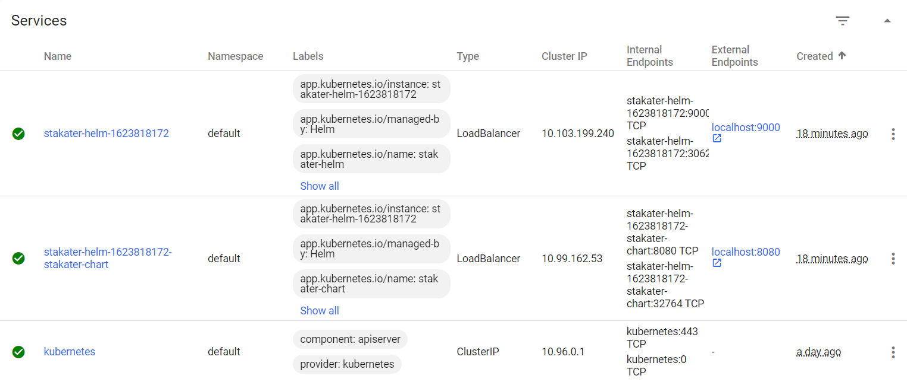

# Helm Chart for Backend and Frontend!

This Helm Chart allows to create the Backend and Frontend resources for Kubernetes at once. It contains the backend Helm Chart named stakater-chart as a nested chart, so the backend becomes a dependency for the frontend. The following commands allows to create and verify the resource for Kubernetes, and as you might notice the environment variable NAME is passed through the install process:

```
helm create stakater-helm
helm lint .\stakater-helm
helm template .\stakater-helm
helm install --generate-name .\stakater-helm --set stakater-chart.env.NAME="Stakater"
```

The commands from above were executed in Windows PowerShell, that's why the syntax.


